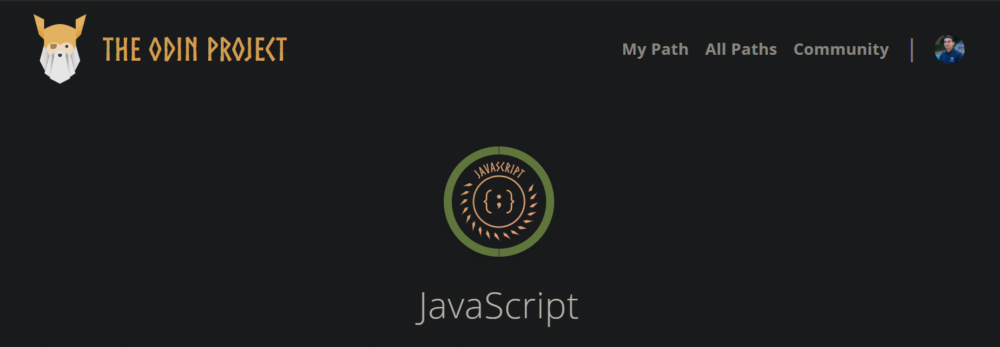

<h1 align="center">
[The Odin Project: Javascript] - List of Completed Projects
</h1>

<!-- AUTO-GENERATED-CONTENT:START (STARTER) -->

  

## Intro

Here you will find all the projects that I completed along with their GitHub Repo. This was a great course that taught me so much.

The course consisted of 40 lessons and 12 projects. Some of the concepts I learned:

-   Reviewing and learning concepts such as:
-   Using Vanilla JS to make UIs
-   DOM manipulation
-   Factory functions and the module pattern
-   OOP Principles
-   Webpack and npm
-   Asynchronous JavaScript
-   Frameworks (React and Vue)
-   Unit Testing (Jest)

This was not taught in class, but I went out of my way to practice other technologies and concepts that are needed to be a Frontend developer

-   Firebase
-   React Context
-   Styled Components
-   Material UI
-   React Bootstrap
-   Dribble (For design inspiration)
-   Gatsby Framework
-   Redux
-   Setting up projects with ESLint and Prettier

## The projects:

### Library
- About: 
  - A tracker to record all the books you have read!
  -   [Code](https://github.com/salvillalon45/theOdinProject-Library)
  -   [Live Site](https://salvillalon45.github.io/theOdinProject-Library/)
- Implementation:
  - Used HTML, CSS, JavaScript to complete project
  - Used Object constructors to create new library instances and organize code
  - Built with Firebase for data storage
  
---

### Tic Tac Toe
- About: 
  - Created a 2 player tic tac toe game!
  -   [Code](https://github.com/salvillalon45/theOdinProject-TicTacToe)
  -   [Live Site](https://salvillalon45.github.io/theOdinProject-TicTacToe/)
- Implementation:
  - Used HTML, CSS, JavaScript to complete project
  - Used JavaScript Factory functions to organize code
  
---

### Restaurant Page
- About: 
  - Created a sample restaurant landing page for Sal's Kitchen
  -   [Code](https://github.com/salvillalon45/theOdinProject-RestaurantPage)
  -   [Live Site](https://salvillalon45.github.io/theOdinProject-RestaurantPage/index.html)
- Implementation:
  - Used DOM manipulation to dynamically render the entire contents of the website
  - Built with JavaScript Factory functions to organize code. 
  - Practice using NPM and Webpack    

---

### Todo List
- About: 
  - Created a To-Do list application. You can create projects. Each project can have tasks. You can add, edit, or delete tasks from a project as well
  -   [Code](https://github.com/salvillalon45/theOdinProject-TodoList)
  -   [Live Site](https://salvillalon45.github.io/theOdinProject-TodoList/)
- Implementation:
  - Used DOM manipulation to dynamically render the entire contents of the website
  - Built with JavaScript Factory functions to organize code. 
  - Practice using NPM and Webpack
  - Designed with LocalStorage to maintain storage of projects & tasks
 
---

### Weather App
- About: 
  - Created a Weather App! Enter the city name and it will show the humidity, wind, Fahrenheit, Celsius, and the condition of the sky currently happening in the city
  -   [Code](https://github.com/salvillalon45/theOdinProject-WeatherApp)
  -   [Live Site](https://salvillalon45.github.io/theOdinProject-WeatherApp/)
- Implementation:
  - Built using Vue.js. Used async/await to fetch data from the Open Weather Map API
  - Built with JavaScript factory functions to organize code

---

### Testing Practice with Jest
- About: 
  - Used Jest to practice creating tests for a series of problems that include:
  - A capitalize function that takes a string and returns it with the first character capitalized.
  - A reverseString function that takes a string and returns it reversed.
  - A calculator object that contains functions for the basic operations: add, subtract, divide, and multiply. Each of these functions should take two numbers and return the correct calculation.
  - A caesarCipher function that takes a string and returns it with each character “shifted”. Read more about how a Caesar cipher works on this website.
  - An analyzeArray function that takes an array of numbers and returns an object with the following properties: average, min, max, and length.
  -   [Code](https://github.com/salvillalon45/theOdinProject-TestingPracticeJest)

---

### Battleship
- About: 
  - Created a player versus computer Battleship game. Players can set five ships and change the rotation of the ship placement
  -   [Code](https://github.com/salvillalon45/theOdinProject-Battleship)
  -   [Live Site](http://theodinproject_battleship.surge.sh/)
- Implementation:
  - Used Jest to implement Test Drive Development. First I created tests to see if the logic worked, then I focused on the UI
  - Implemented project using React. Created reusable components and CSS selectors
  - Used useLayoutEffect to help render the application again when I am trying to make changes to the DOM
  - useRef when trying to use state values inside event listeners
  
---

### CV Application
- About: 
  - Created a CV builder using React. Allows users to add education, skills, experience, and contact info. User can edit their previously submitted data
  -   [Code](https://github.com/salvillalon45/theOdinProject-CVApplication)
  -   [Live Site](http://theodinproject_cv.surge.sh/)
- Implementation:
  - Used React, React Bootstrap, and Sass to complete the project. Used Surge.sh to deploy
      - Learned what Lexical Scope is and how it is used in react. We can use arrow functions to not lose access to calling functions
---

### Memory Card
- About: 
  - Created a memory card game. See how far your memory takes you!
  -   [Code](https://github.com/salvillalon45/theOdinProject-MemoryCard)
  -   [Live Site](http://theodinproject_sv_memorygame.surge.sh/)
- Implementation:
  - Practice using Gatsby for the first time! 
  - Used React Hooks and LifeCycle methods to organize and implement logic. Sass for styling
  
---

### Shopping Cart
- About: 
  - Created a full-scale shopping experience! Allows users to view items, select how many items, and place them in the shopping cart. The user finalizes their shopping experience by checkout 
  -   [Code](https://github.com/salvillalon45/theOdinProject-ShoppingCart)
  -   [Live Site](http://sv_shoppingcart.surge.sh/)
- Implementation:
  - Used Redux & Gatsby to create applications. 
  - Took advantage of Gatsby's dynamic routing & awesome page directory system to organize code and implement logic 

---  

### Where's Waldo
- About: 
  - Created a fun Where’s Waldo game. See if you can find all three characters in the shortest time possible
  -   [Code](https://github.com/salvillalon45/theOdinProject-where-sWaldo)
  -   [Live Site](https://theodinproject-whereswaldo.web.app/)
- Implementation:
  - Used Gatsby, Material UI, and Styled Components to create the project. 
  - Built with Firebase to store scores of all users who have played. Also, Firebase hosting to deploy and host

---

### Your Story
- About: 
  - I challenged myself to create something new, something that could help people. As I was thinking, I realized that something that I value and that has helped me a lot is the power of reflection. Reflecting allows people to stop and think about what they are doing. Helps clarify what are the next steps you want to create and take. I wanted to create a tool that people can use to reflect. This is how Your Story was born! 
  -   [Code](https://github.com/salvillalon45/your-story)
  -   [Live Site](https://your-story-sv.web.app/)
- Implementation:
  - Developed a full-stack application that lets users create, edit, delete, and print to PDF their newly created events timeline. Implement authentication using Firebase
   - Used Gatsby.js, Material UI, Styled Components, and Firebase (Real Time - DB, Auth, Hosting) to complete the project

---

### Frameworks (Vue)
-   They do not have this lesson anymore, but the purpose was to redo a project we did in the past and do it again with a framework. I wanted to try Vue so I did the restaurant page in Vue
-   [Code](https://github.com/salvillalon45/theOdinProject-Frameworks)
-   [Live Site](https://salvillalon45.github.io/theOdinProject-Frameworks/)
